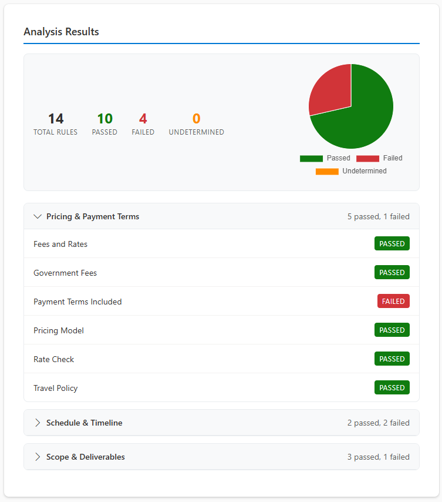
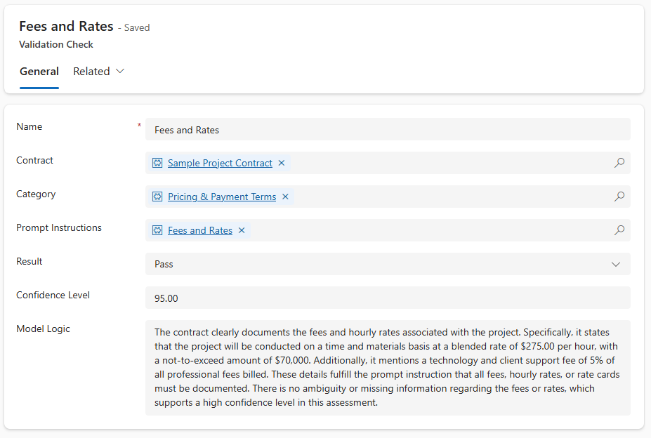
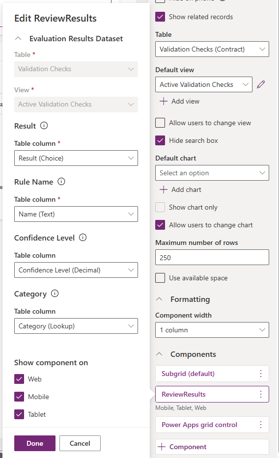

# Review Results PCF Control
This repository contains the Review Results PCF Control, a custom visualization component designed for Microsoft Power Apps and Dynamics 365. It is a core component of the Reference Architecture: Automated Document Review and Approval.

## Overview
The Review Results control replaces the standard Dataverse subgrid with a categorized, high-readability dashboard. It is specifically designed to visualize AI-generated compliance results, allowing users to quickly identify which business rules passed, failed, or remained undetermined. It is designed to be embedded directly on a subgrid in a record of a Model Driven app (MDA)

## Features
- **Categorized Grouping:** Automatically groups evaluation results by their defined Category lookup. 
- **Status Visualization:** Provides immediate visual cues for Pass/Fail/Undetermined status choices. 
- **Contextual Logic:** Easy access to the underlying AI model logic for auditability. 

## Configuration & Installation

### Prerequisites

- **Dataverse Tables:** Ensure the Evaluation Result table is created with the required schema (Result Choice, Rule Name, Confidence, and Category). 
- **Environment:** A Power Platform environment with PCF for Model-Driven Apps enabled.

### Implementation Steps

To add this control to your primary record form (e.g., Contract or Invoice):
- Add Subgrid: Insert a subgrid on your form filtered to the Active Evaluation Results related table. 
- Apply Component: In the subgrid properties, select Components > Add Component and choose Review Results Control. 
- Property Mapping: Map the following component properties to the corresponding Dataverse columns: 
- Result Choice: The Global Choice field (Pass/Fail/Undetermined).
- Rule Name: The primary name or description string of the rule.
- Confidence: The decimal field representing the AI's confidence score.
- Category: The lookup field to the Evaluation Category table.

Publish: Save and Publish the form. 

## Technical Details
Framework: Power Apps Component Framework (PCF)
Control Type: Dataset
Primary Language: TypeScript / React (if applicable)

## License
This project is licensed under the MIT License - see the LICENSE file for details.
